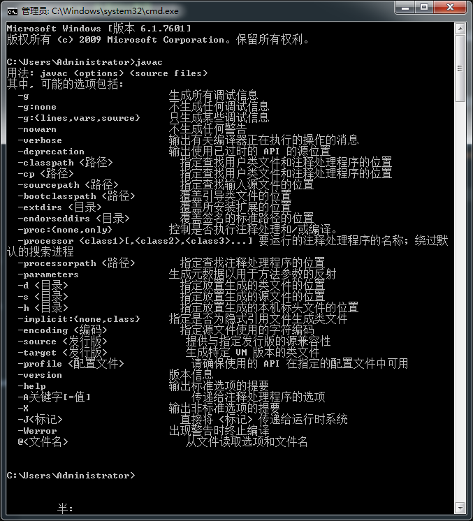

# 安卓学习笔记

和一般人不同，我一直认为最适合我的学习方式就是在实际项目中学习，可惜大多数时间是没有机会参与实际项目的，但我们初中语文老师说：

> 有困难要上，没有困难创造困难也要上！

所以虽然现在没有项目给我，那我就自己创造需求去做，下面就是一些心得。

# 1. 很傻的计算器

昨天百度了一个大牛的[入门项目教程](http://blog.csdn.net/anddlecn/article/details/51461965?locationNum=9&fps=1)，今天终于把项目简单写出来了。。。

1. 首先就是安装环境。

由于安卓的底层开发语言就是 java ，所以首先安装 java 环境，在官网下载 jdk 后安装在你想要的位置（请记住这个位置），然后配置环境变量，检查  
计算机 > 属性 > 高级系统属性 > 环境变量 > 系统变量 >  
检查是否有 JAVA_HOME 这一变量，有检查是否和安装路径相同，不同则建立变量并设置值为安装路径  
之后新建 classpath 变量赋值为： `.;%JAVA_HOME%\lib\dt.jar;%JAVA_HOME%\lib\tools.jar`  
最后在 path 变量值得最前面添加：`%JAVA_HOME%\bin;%JAVA_HOME%\jre\bin;`

之后就可以 ctrl + r 打开 cmd 输入 javac ，如果打印出下面的图就就说明成功了：

之后在 android studio 官网下载最新版软件，跟着点，在是否加入 path 的选项上加 √ ，之后一马平川的安装就好，