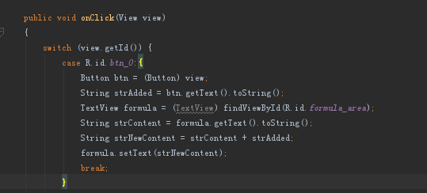
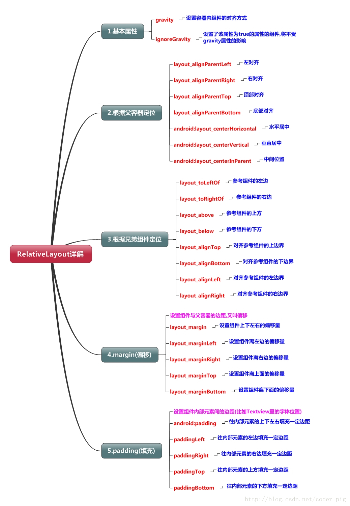

# 安卓学习笔记

和一般人不同，我一直认为最适合我的学习方式就是在实际项目中学习，可惜大多数时间是没有机会参与实际项目的，但我们初中语文老师说：

> 有困难要上，没有困难创造困难也要上！

所以虽然现在没有项目给我，那我就自己创造需求去做，下面就是一些心得。

# 1. 很傻的计算器

昨天百度了一个大牛的[入门项目教程](http://blog.csdn.net/anddlecn/article/details/51461965?locationNum=9&fps=1)，今天终于把项目简单写出来了。。。

1. 首先就是安装环境。

由于安卓的底层开发语言就是 java ，所以首先安装 java 环境，在官网下载 jdk 后安装在你想要的位置（请记住这个位置），然后配置环境变量，检查  
计算机 > 属性 > 高级系统属性 > 环境变量 > 系统变量 >  
检查是否有 JAVA_HOME 这一变量，有检查是否和安装路径相同，不同则建立变量并设置值为安装路径  
之后新建 classpath 变量赋值为： `.;%JAVA_HOME%\lib\dt.jar;%JAVA_HOME%\lib\tools.jar`  
最后在 path 变量值得最前面添加：`%JAVA_HOME%\bin;%JAVA_HOME%\jre\bin;`

之后就可以 ctrl + r 打开 cmd 输入 javac ，如果打印出下面的图就就说明成功了：


之后在 android studio 官网下载最新版软件，跟着点，在是否加入 path 的选项上加 √ ，之后一马平川的安装就好。

2. 新建项目

这时候会下载大量的依赖包，主要是安卓版本依赖包啥的，可能需要较长时间，下次就不会了。

新建项目时选择空白模板，然后打开  
app > res > layout > active_main.xml(或者其他名字，这里暂时只有一个页面一个文件)

删除旧内容后选择竖排布局 `<LinearLayout></LinearLayout>`,熟悉的标签式布局，用各种属性调整页面布局，文件最上方的标签`<?xml version="1.0" encoding="utf-8"?>`，这个我一眼就看出来是声明版本号，声明文档格式为‘utf-8’，然后按照教程老老实实一步一步布局下来，大体成型后添加按钮点击事件`android:onClick="onClick"`,又是熟悉的语法,之后到  
app > java > com.anddle.你的项目名 > MainActivity

中添加事件，在类 MainActivity 中添加公用返回值为空的事件 onClick ,传入一个参数（View view）,这里以以后的参数注意 Alt + Enter 引入引用，onClick 函数教程中采用了 switch case 判断用户点击的按钮的 id 的方式执行事件。这里遇到一个愚蠢的问题，之前遇到不管点哪个按钮都弹出错误的提示，判断是 switch 直接执行最后一个事件，然后发现没有给 case 里的语句块添加 break; 弹出的过。。。

然后 debug 编译打包后我第一个很傻的应用就完成了，大部分代码都是照着抄，但毕竟有前端的底子，xml 语法看起来让人联想很多。之后进入具体的基础学习阶段。

## 二，基础学习

> 1.[资料](http://www.runoob.com/w3cnote/android-tutorial-relativelayout.html)

### 2.0 Android 中的布局：
    * LinearLayout(线性布局)
    * RelativeLayout(相对布局)
    * TableLayout(表格布局)
    * FrameLayout(帧布局)
    * AbsoluteLayout(绝对布局)
    * GridLayout(网格布局)

### 2.1 LinearLayout 线性布局

线性布局比较适合屏幕适配，用的比较多的属性就是 weight （权重属性：此属性安卓会自己计算视图块的大小），其他属性见下图：


### 2.2 RelativeLayout 相对布局

当界面比较复杂的时候，需要嵌套多层的 LinearLayout,这样就会降低UI Render的效率(渲染速度),而且如果是listview或者GridView上的 item,效率会更低,另外太多层LinearLayout嵌套会占用更多的系统资源,还有可能引发stackoverflow（堆栈溢出）;
所以：**尽量使用RelativeLayout + LinearLayout的weight属性搭配使用吧**


#### 2.2.1 父容器定位属性示意图


### 2.2.2 兄弟组件定位

和前端html布局很类似，同一父组件的子组件之间就是兄弟组件，但实际效果直接用属性体现出来
```
<SomeView
    ...
    android:id="@+id/id1"                 // 组件单独id后面会用作判断
    android:layout_centerInParent="true"  // 处于父组件中央位置
    ...
    />

<BrotherLeft
    ...
    android:layout_toLeftOf="@id/id1"     // 靠到 id1 组件的左边
    android:layout_centerVertical="true"  // 垂直方向居中
    ...
    />

<BrotherRight
    ...
    android:layout_toRightOf="@id/id1"     // 靠到 id1 组件的右边
    android:layout_centerVertical="true"   // 垂直方向居中
    ...
    />
<BrotherTop
    ...
    android:layout_above="@id/id1"        // 靠到 id1 组件的上面
    android:layout_centerVertical="true"  // 垂直方向居中
    ...
    />
```

### 2.2.3 margin与padding

这与前端中的盒模型看似相似，但其实完全不同。

#### margin 

在相对布局中，使用margin时会把组件挤开，但当组件被顶到视图边界时，与浏览器直接顶出
视图外不同，他会让元素等被压的方向等比缩小组件。margin是可以给负数达成类似css定位的效果。

#### padding 

padding 则更不同，直接使用 padding 时，各方向按给的数值填充组件，
如果给的是 paddingLeft ,那不仅左边会发生“填充”，上下两边，或者说，
相邻的两边会同样按一定数值发生填充。

## 2.3 Tablelayout 表格布局

#### 2.3.1 如何确定行数与列数

> 1. 如果我们直接往TableLayout中添加组件的话，那么这个组件将沾满一行
> 2. 如果我们想一行上有多个组件的话，就要添加以TableRow的容器，把组件都丢在里面
> 3. TableRow 中的组件个数就决定了该有多少列，而列的宽度由该列中最宽的单元格决定
> 4. TableRow 的 layout\_width 属性，默认是 fill\_parent,自己改不了，但layout\_height默认是
    wrapten\_content ,我们可以改
> 5. 整个表格的宽度取决于父容器的宽度（占满）
> 6. 有多少行就要自己数了，一个tablerow一行，一个单独组件一行，多少列看tableRow中的组件个数，按最多一个为标准。 

#### 2.3.2 几个常用属性

> 1. android:collapseColumns: 设置需要__被隐藏__的列的序号
> 2. android:shrinkColumns: 设置允许__被收缩__的序列号
> 3. android:stretchColumns: 设置运行__被拉伸__的列的列序号

这三个属性都是从0开始计算的，可设置多个，用逗号隔开，也可设置*全选

> 4. android:layout_column: 标示跳过某个格子，从1开始计数
> 5. android:layout_span: 合并单元格