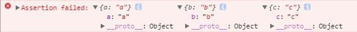
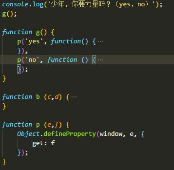

# console + 访问器属性

之前在腾讯大前端团队的[官方主页](http://www.alloyteam.com/)上打开谷歌调试 console 突然发现企鹅家和其他家的不一样，居然是可以交互的！突然很好奇，是怎么实现的。

第一反应就是查文档：

> ## window.console
>> 1. console.assert(false, obj[obj ,... ])   
>> 输出对象列表
>> 
>> 2. console.clear()  
>> 清空 console
>> 3. console.count() 
>> 以参数记录调用次数
>> 4. console.dir()
>> 打印三角符号开头的信息
>> 5. console.error()
>> 打印错误信息

最终得到结论：前端的console是没有接受输入功能的。

但这个和之前学vue时的演示很像，控制台输入内容，页面内元素改变，于是就联想到也许可以用访问器属性试试。

## 访问器属性

js 中属性分两种，一种数据属性，一种访问器属性，访问器属性不包含数据值，而是提供get和set接口操作数据，同时具有`configurable`（标示能各种修改）、`enumerable`(能否forin循环)。

访问器属性不能直接声明，要通过 `Object.defineProperty()` 这个接口定义。我们这里只是完成控制台输入访问器属性名，进行左查询调用get函数，函数内继续打印，造成是控制台受到监控的假象。



## 加一点

平时控制台输入变量按回车后一般打印出正常信息后还会打印出一个半透明的`undefined`,但发现企鹅队是没有的。

一点头绪没有，索性直接看他代码，才发现原来返回值问题，执行的函数内加如`return`：

```
return console.log('那就给你力量，啊哈哈哈哈'), "哈~美~哈~美~哈！！！！"; // 这里表达式用逗号隔开;这样返回值就变成我们规定的了
```