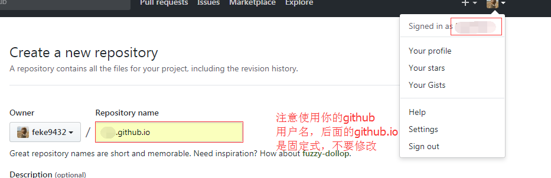

# 使用 github_pages 搭建个人博客

## 建立仓库

默认你熟悉[git]操作，并且已经注册了[github]账号并熟悉一般操作。

点击右上角的加号，选择 New repository 建立新仓库，注意使用`you_github_name.github.io` 固定格式。

建立后在此仓库中选择设置（Settings）向下翻到 github pags ，选择 chose theme，选择一个你喜欢的样式主题，最后commit一下就成功建立博客了。

接下来在浏览器中访问，`you_github_name.github.io`，就是你的博客首页了。

## 美化博客

只有简单的模板页显然是不够的，下面就开始美化开发。