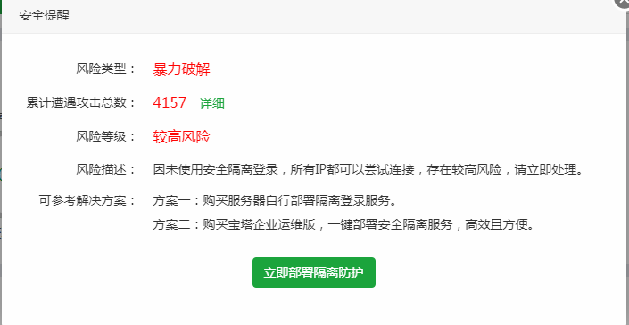

# 突然提示我遭到了攻击。。



暴力突破，其实就是穷举法登录我的服务器，毕竟不是菜鸟了，一看到这个我心里就有了解决办法：

1. 修改root用户名密码

2. 修改可访问ip规定只有我的工作机可以登录我的服务器

3. 关掉ssh 。。。好吧，这一条专门逗比

简单判断一下后我选择了方法2，大概操作如下：

打开配置文件
```
vi /etc/ssh/sshd_config // 修改这个文件

```

在最后一行添加 
```
AllowUsers root@你的ip
```

保存并退出
```
按ESC键，输入 :wq 
```
嘿嘿，然后等明天再看看有没有攻击了

2017-12-22：今天看到攻击信息还是4601次，显然那个攻击者已经放弃了，实际测试非我本机ip即使密码正确也不能登录。