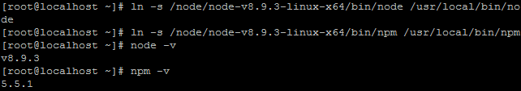

# linux 搭建 node.js 服务器

买了国内某云服务器，

安装[PuTTY](http://www.putty.org/),输入服务器唯一物理ip后，登录到服务器，

使用linux安装了[宝塔面板](https://www.bt.cn/btcode.html)，以及一堆推荐服务。

> linux 常用指令：
> 1. cd dirName 打开文件夹，cd .. 打开上级文件夹
> 2. ls 查看当前文件夹内容
> 3. rm 文件目录：删除对应文件目录；rm -rf 文件目录：删除对应文件目录的文件夹
> 4. wget 远程路径：下载对应路径文件到当前文件夹。
> 5. xz -d **.tar.xz ：解压xz后缀的压缩文件
> 6. tar -xv -f **.tar : 解压tar后缀的压缩文件。
> 7. ln -s /path\_to/bin/node /usr/local/bin/node : 建立软连接，使之可以全局运行，path\_to是实际文件夹路径

## 遇到的坑：

最开始打算本地电脑下载node安装包，然后上传到linux的，结果下载=》解压=》上传=》非常漫长的时间。。。。

然后上传失败：部分文件上传失败，估计因为文件目录过多，然后直接使用上面 ln 语法建立软连接，导致各种报错：

```
-bash: node: command not found
ln: failed to create symbolic link '/tmp/mysql.sock': File exists
...
```
愁的**头发又白**了几根。。。

但终究功夫不负有心人，折腾了大半天功夫终于查到一个4年前的帖子：[新手问一个很2的问题...](https://cnodejs.org/topic/53116a24b96ffedc1a005081)，才茅厕顿开，（感谢[cnode论坛](https://cnodejs.org/)）

检查目录发现自己上传的少了几个，想到也许上传失败了，各种百度后，发现原来可以直接操作linux服务器下载安装包，下载后直接解压（解压还解压失败一次，各位如果还是遇到上面的问体，不妨删除文件，重新解压试试），速度提高一大截，但问题依旧没有解决，还是各种报错。。。

再回头看看那个帖子，谷歌翻译了一下报错信息：文件已存在，于是想到是不是之前建立软连接干扰了这次安装？

`rm /usr/local/bin/node` ; `rm /usr/local/bin/npm` 删除旧的软连接

然后重点来了：

**请执行“cd”语法到全局环境，然后再执行“ln”语法建立软连接**

请原谅我的小白见识，这些词用的不用想都很多错误，请一定用各种linux语法知识啪啪啪打我的脸（笑）。

最后激动人心的环节到了，依旧在全局环境输入：



看到打印出的版本号我泪牛满面。。。