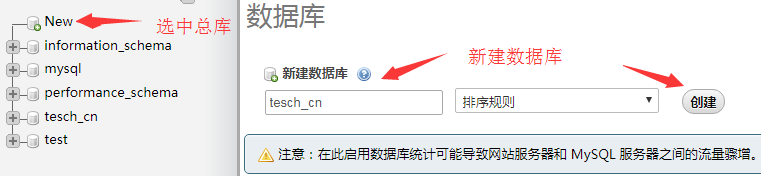
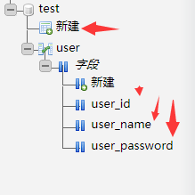

# linux 搭建 node.js 服务器

买了国内某云服务器，

安装[PuTTY](http://www.putty.org/),输入服务器唯一物理ip后，登录到服务器，

使用linux安装了[宝塔面板](https://www.bt.cn/btcode.html)，以及一堆推荐服务。

> linux 常用指令：
> * 鼠标滑动选中目录名，右键鼠标就可以复制了。
> 1. cd dirName 打开文件夹，cd .. 打开上级文件夹
> 2. ls 查看当前文件夹内容
> 3. rm 文件目录：删除对应文件目录；rm -rf 文件目录：删除对应文件目录的文件夹
> 4. wget 远程路径：下载对应路径文件到当前文件夹。
> 5. xz -d **.tar.xz ：解压xz后缀的压缩文件
> 6. tar -xv -f **.tar : 解压tar后缀的压缩文件。
> 7. ln -s /path\_to/bin/node /usr/local/bin/node : 建立软连接，使之可以全局运行，path\_to是实际文件夹路径
> 8. echo ：打印某些东西，比如 echo $PATH 打印环境变量

## 遇到的坑：

最开始打算本地电脑下载node安装包，然后上传到linux的，结果下载=》解压=》上传=》非常漫长的时间。。。。

然后上传失败：部分文件上传失败，估计因为文件目录过多，然后直接使用上面 ln 语法建立软连接，导致各种报错：

```
-bash: node: command not found
ln: failed to create symbolic link '/tmp/mysql.sock': File exists
...
```
愁的**头发又白**了几根。。。

但终究功夫不负有心人，折腾了大半天功夫终于查到一个4年前的帖子：[新手问一个很2的问题...](https://cnodejs.org/topic/53116a24b96ffedc1a005081)，才茅厕顿开，（感谢[cnode论坛](https://cnodejs.org/)）

检查目录发现自己上传的少了几个，想到也许上传失败了，各种百度后，发现原来可以直接操作linux服务器下载安装包，下载后直接解压（解压还解压失败一次，各位如果还是遇到上面的问体，不妨删除文件，重新解压试试），速度提高一大截，但问题依旧没有解决，还是各种报错。。。

再回头看看那个帖子，谷歌翻译了一下报错信息：文件已存在，于是想到是不是之前建立软连接干扰了这次安装？

`rm /usr/local/bin/node` ; `rm /usr/local/bin/npm` 删除旧的软连接

然后重点来了：

**请执行“cd”语法到全局环境，然后再执行“ln”语法建立软连接**

请原谅我的小白见识，这些词用的不用想都很多错误，请一定用各种linux语法知识啪啪啪打我的脸（笑）。

最后激动人心的环节到了，依旧在全局环境输入：


看到打印出的版本号我泪牛满面。。。

## 顺便安装 express

有了经验就是好办事，先打印出node根目录方便右键复制，然后cd到全局，然后：
```
$ npm install express -gd // 全局安装express 
$ npm install express-generator -g // 全局安装experss生成器
$ ln -s /node/node-v8.9.3-linux-x64/bin/express /usr/local/bin/express // 建立全局软连接
$ express --version // 查看是否安装成功
```


## 依旧顺便开个服务器做测试

情绪高涨的时候就要继续折腾！！

接下来打开预先就打算做node目录的node文件夹，使用 express server_01 生成一个服务器模板，然后：

```
cd node                     // 打开工程目录
express server_01           // 生成项目模板
cd server_01 && npm install // 打开目录并安装依赖
npm start                   // 开始运行程序
```

然后本机服务器访问 ***.**.**.**:3000 ,然后一脸懵逼，为啥404了？

也许是服务器没有开放3000端口？

查了很多服务器端口的资料，但却没有解决问题，突然想到现在已经安装了宝塔面板，宝塔帮忙安装了Nginx，是不是产生冲突了？另一方面可以用宝塔测试3000端口啊，于是，立刻使用一键建站生成了一个3000端口的php 站点，这时候当然express的默认端口就被占用了，实际外网访问服务器的3000端口是可以拿到站点信息的，然后删除刚测试用的站点，解除3000的占用，重新登录linux，运行node服务器，然后我又：

**一脸懵逼**

成功了，再次外网访问3000端口打印出express字样，会不会是宝塔建站帮我做了一些配置呢？
主要这些配置如果没有宝塔我自己要怎么配置呢？

求大佬解答。。。

## 继续踩坑

总算运行起来服务器了，宝塔生成一个ftp专门管理node服务器的文件，简单修改服务器添加了一个句 s b 的接口后跑起来，顺利的在本地机器上访问到接口，拿到了数据，然后，关掉PuTTY，然后

**一脸懵逼**

服务不能访问了？？

百度谷歌后，发现我现在其实需要的是“后台运行我的node.js程序”，“守护进程”，这里再次真诚地感谢cnode社区。

node.js 后台运行程序方法很多,应当按使用场合选择技术：

> 1. supervisor :  开发环境使用，非常适合调试。
> 2. forever    :  管理多个站点，每个站点访问量不大，不需要监控
> 3. pm2        :  网站访问量比较大，需要完整的监控界面
> 4. nohup      :  最简单的办法  nohup node app.js &

这里选择了 [forever](https://github.com/foreverjs/forever) ，毕竟只是做些尝试。

跟着教程 `npm install forever -g` ,安装完后发现：

```
forever --help
-bash: forever: command not found
```

联想到之前 express 全局安装后也是手动安装的软连接，也许是某些配置没有配置好？PATH？

再次使用 ln -s 生成软连接：
```
ln -s 你的node目录+/lib/node_modules/forever/bin/forever /usr/local/bin
```

之后就可以全局使用forever了。

打开之前建立的server_01,执行
```
forever start ./bin/www // express模板跑服务器
```

然后关掉PuTTY也可以访问我们的服务了

## 常用 forever 命令：

> 1. forever start test.js|[pid]    // 后台开启服务。
> 2. forever stop test.js|[pid]     // 停止后台服务。
> 3. forever restart test.js|[pid]  // 重启后台服务。
> 4. forever list test.js|[pid]     // 打印现有服务。

## 继续折腾，安装mysql

之前宝塔面板已经帮我们把mysql安装好了,然后我们自己安装node.js的mysql管理
```
npm install mysql
```

想要操作数据库先要有库可用，所以我们先用之前安装好的phpMyAdmin新建数据库，做测试所以名字用了**test**。




并且建立一张用户表，三个参数，id，user\_name，user\_password，并输入一条初始数据



然后尝试在我们的node程序中调用数据库
```
var mysql = require('mysql'); // 引入

var connection = mysql.createConnection({   // 配置链接信息
    host: 'localhost',  // 数据库地址，一般在本地
    user: '...',        // 用户名
    password: '...',    // 密码
    database: '...'     // 表名
}); 
/*
    具体使用时建议封装逻辑，
    先建立链接，query请求数据，
    请求完毕后关闭链接。
*/
connection.connect();
connection.query('SELECT * FROM user', (err, rows, fields) => {
    if (err) throw err;
    console.log(rows);
});
connection.end();
```

简单做一个测试接口看看能否获取数据库信息：
```
router.get('/getUser', (req, res, next) => {
    var connection = mysql.createConnection(mysqlConfig);  // 注意每次查询数据库都需要重新生成链接对象。
    connection.connect();
    connection.query('SELECT * FROM user', (err, rows, fields) => {
        if (err) throw err;
        console.log(rows);
        connection.end();
        res.send(rows)
    });
})
```
浏览器访问你的服务器ip:3000/getUser,如果打印出之前输入的信息说明成功了。

